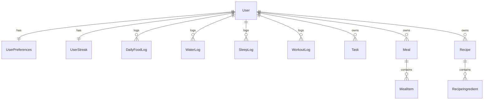

<div align="center">

# PinicoFit — Server (Backend)

NestJS + Prisma backend powering the PinicoFit fitness/productivity experience: authentication, daily logs, streak logic, and a BFF “aggregator” endpoint optimized for the Goals dashboard.

<!-- Badges -->
<p>
  
  
  
  
</p>
<p>
  
  
  
  
</p>

</div>

## Quick Access

[🇺🇸 English](#en-us) • [🇧🇷 Português](#pt-br)

---

## <a id="en-us"></a>🇺🇸 English

### High-level architecture

This server follows conventional NestJS layering:

- **Controllers** expose REST routes (e.g. `meals`, `water`, `sleep`, `tasks`, `workouts`, `streak`, and `goals/daily-summary`).
- **Services** implement business logic and orchestrate Prisma queries.
- **DTOs** + **global ValidationPipe** enforce request validation and type transformation.
- **AuthGuard** enforces JWT authentication and attaches `req.user.sub` for ownership-safe operations.
- **PrismaService** provides a shared Prisma Client instance across modules.

Key modules in `src/`:

- `auth/`: sign-in + JWT generation and verification guard.
- `users/`: user profile + preferences (goals toggles, tolerances, email verification, reporting hooks).
- `meals/`, `foods/`, `recipes/`: nutrition domain (food library, meals, recipes, daily food logs).
- `water/`: water logging + history (weekly/month).
- `sleep/`: sleep logging (including naps) + history.
- `workouts/`: workout settings, presets, daily workout, logs, history.
- `tasks/`: daily tasks and dated tasks.
- `streak/`: cross-domain “contract” evaluation for the day (uses preferences + daily logs).
- `goals-aggregator/`: BFF endpoint that consolidates daily data for the frontend Goals dashboard.
- `health/`: health endpoint for uptime checks and platform probes.

### Security & validation

Implemented security primitives:

- **JWT Bearer auth**: the guard reads `Authorization: Bearer <token>` and verifies using `JWT_SECRET` (`src/auth/auth.guard.ts`).
- **Ownership-scoped reads/writes**: controllers/services use `req.user.sub` consistently to isolate user data.
- **Input validation**: Nest global `ValidationPipe({ transform: true })` + class-validator DTOs (`src/main.ts`).
- **i18n-style error keys**: many exceptions throw structured keys (e.g. `server.errors.*`) intended for frontend translation.

### Database (Prisma + PostgreSQL)

Prisma schema is defined in `prisma/schema.prisma` and models a “daily logs” domain:

- `User` (root aggregate)
  - 1:1 `UserPreferences` (goals/tolerances/toggles + onboarding-driven targets)
  - 1:1 `UserStreak` (+ `UserStreakDay` tracking)
  - 1:N domain entities:
    - nutrition: `DailyFoodLog`, `Meal`, `MealItem`, `Recipe`, `RecipeIngredient`, `Food` + favorites
    - water: `WaterLog`
    - sleep: `SleepLog`
    - workouts: `WorkoutLog`, `WorkoutPreset`, `WorkoutSettings`
    - tasks: `Task`
    - comms: `EmailVerificationToken`, `MonthlyReportDispatch`

#### ERD overview (simplified)



### Performance-focused API: Goals aggregator (BFF)

The Goals dashboard needs many pieces of data at once (profile/preferences, streak, water, meals, workout settings, tasks, sleep). To avoid “N separate requests”, the backend exposes:

`GET /goals/daily-summary?date=YYYY-MM-DD`

Implemented in `src/goals-aggregator/` and designed to:

- **Fetch in parallel** via `Promise.all()`
- **Reuse existing services** without changing their business logic
- **Normalize dates to ISO strings** in the aggregated payload

### Health checks & deployment notes (Render)

- **Health endpoint**: `GET /health` returns `{ status: "ok", timestamp }` (`src/health/health.controller.ts`).
- Designed to run cleanly on platforms like **Render** where a simple HTTP probe is required.
- By default, the app listens on **port 3000** (`src/main.ts`). Ensure your hosting service routes traffic accordingly.

### API documentation overview

This repository is intentionally “code-first”: endpoints are easy to audit by reading controllers in `src/**/**.controller.ts`.

Common patterns:

- Auth:
  - `POST /auth/signin`
- User:
  - `GET /users/me`
  - `PATCH /users/:id`
  - `PATCH /users/preferences/goals`
- Daily logs:
  - Meals: `GET /meals/log?date=...`, `POST /meals/log`
  - Water: `GET /water/today`, `POST /water/log`, `GET /water/history`
  - Sleep: `GET /sleep/today?date=...`, `POST /sleep/log`, `GET /sleep/history`
  - Workouts: `GET /workouts/today?date=...`, `POST /workouts/log`, `GET/PATCH /workouts/settings`, presets, history
  - Tasks: `GET /tasks/today?date=...`, CRUD under `/tasks`
- Streak:
  - `GET /streak/me?date=...`
- Aggregator:
  - `GET /goals/daily-summary?date=...`

### Setup / Installation

#### Prerequisites

- Node.js **18+** recommended
- PostgreSQL database

#### Install

```bash
cd server
npm install
```

#### Environment

Create `.env` with (examples only):

```bash
DATABASE_URL="postgresql://..."
JWT_SECRET="..."
APP_URL="http://localhost:5173"

# optional (email verification / reporting)
SMTP_HOST="..."
SMTP_PORT="..."
SMTP_USER="..."
SMTP_PASS="..."
MAIL_FROM="PinicoFit <no-reply@your-domain>"
```

#### Prisma

```bash
cd server
npx prisma generate
npx prisma migrate deploy
```

#### Run

```bash
cd server
npm run dev
```

#### Tests

```bash
cd server
npm test
```

<hr />

## <a id="pt-br"></a>🇧🇷 Português

### Arquitetura (visão geral)

O backend segue o padrão clássico do NestJS:

- **Controllers** expõem rotas REST (ex.: `meals`, `water`, `sleep`, `tasks`, `workouts`, `streak` e `goals/daily-summary`).
- **Services** concentram a lógica e orquestram consultas Prisma.
- **DTOs** + **ValidationPipe global** validam requisições e fazem transformação de tipos.
- **AuthGuard** aplica JWT e injeta `req.user.sub` para operações seguras por usuário.
- **PrismaService** fornece um Prisma Client único e compartilhado.

Módulos principais em `src/`:

- `auth/`: login e autenticação via JWT.
- `users/`: perfil e preferências (metas, tolerâncias e verificação de e-mail).
- `meals/`, `foods/`, `recipes/`: alimentação (biblioteca, refeições, receitas e logs diários).
- `water/`: registros de água + histórico.
- `sleep/`: registro de sono (inclui cochilos) + histórico.
- `workouts/`: settings, presets, treino do dia e logs.
- `tasks/`: tarefas diárias e por data.
- `streak/`: avaliação do “contrato do dia” cruzando preferências e logs.
- `goals-aggregator/`: endpoint BFF que consolida dados diários para o GoalsPage.
- `health/`: endpoint de saúde para monitoramento.

### Segurança & validação

- **JWT Bearer**: `Authorization: Bearer <token>` com validação via `JWT_SECRET` (`src/auth/auth.guard.ts`).
- **Isolamento por usuário**: uso consistente de `req.user.sub` para garantir ownership.
- **Validação**: `ValidationPipe({ transform: true })` + DTOs com class-validator (`src/main.ts`).
- **Erros com chaves i18n**: exceptions retornam chaves `server.errors.*` para tradução no frontend.

### Banco de dados (Prisma + PostgreSQL)

O schema Prisma (`prisma/schema.prisma`) modela um domínio centrado em **logs diários**, com `User` como raiz, `UserPreferences` e `UserStreak` em relações 1:1 e múltiplas entidades de log por domínio (alimentação, água, sono, treino e tarefas).

### Endpoint BFF (Goals aggregator)

Para reduzir latência no GoalsPage, existe:

`GET /goals/daily-summary?date=YYYY-MM-DD`

Características:

- **Paralelismo** com `Promise.all()`
- **Reuso** dos services originais (sem duplicar regra de negócio)
- **Normalização** de datas para ISO strings

### Infra (Render) e health check

- `GET /health` retorna `{ status: "ok", timestamp }` e é ideal para monitoramento.
- O servidor escuta **porta 3000** por padrão (`src/main.ts`); configure o serviço (ex.: Render) para rotear para essa porta.

### Setup / Instalação

```bash
cd server
npm install
npx prisma generate
npx prisma migrate deploy
npm run dev
```

